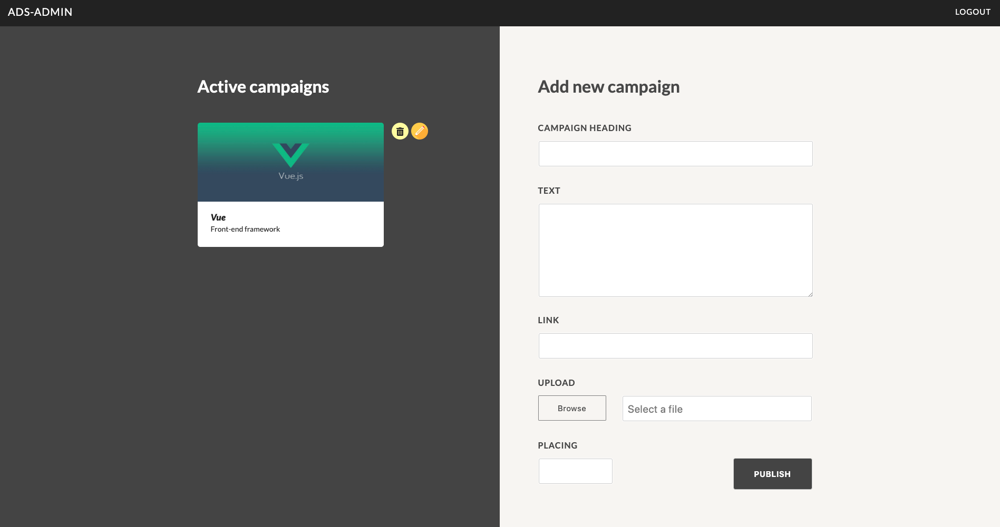

## angular-nestjs

## [Live Website](http://ads-admin-nestjs.s3-website.us-east-2.amazonaws.com)

Simple CRUD application with authentication, authorization, routing, image upload. Using technologies from the modern stack, such as:

* [NestJS](https://github.com/nestjs/nest) - a JS backend framework providing architecture out of the box with a syntax similar to Angular
* [Angular](https://github.com/angular/angular) - a JS frontend framework created by Google
* [RxJS](https://github.com/Reactive-Extensions/RxJS) - reactive extensions for JavaScript
* [Webpack](https://github.com/webpack/webpack) - the ultimate JS bundler - used for the server code since Angular has it under the hood
* [MongoDB](https://github.com/mongodb/mongo) - a NoSQL database
* [Mongoose](https://github.com/Automattic/mongoose) - MongoDB object modeling designed to work in an asynchronous environment
* [TypeScript](https://github.com/Microsoft/TypeScript) - superset of JS which compiles to JS, providing compile-time type checking
* [Passport](https://github.com/jaredhanson/passport) - a popular library used to implement JavaScript authentication
* [jsonwebtoken](https://github.com/auth0/node-jsonwebtoken) - a JavaScript json web tokens implementation by auth0

